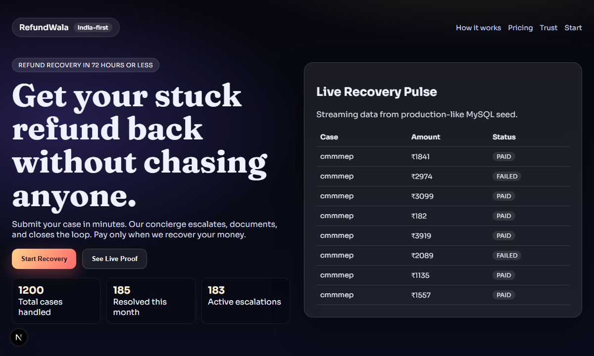
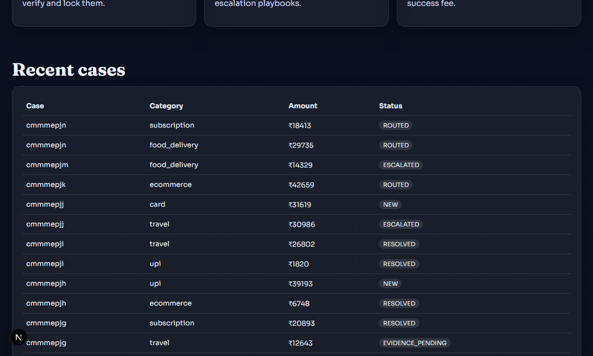
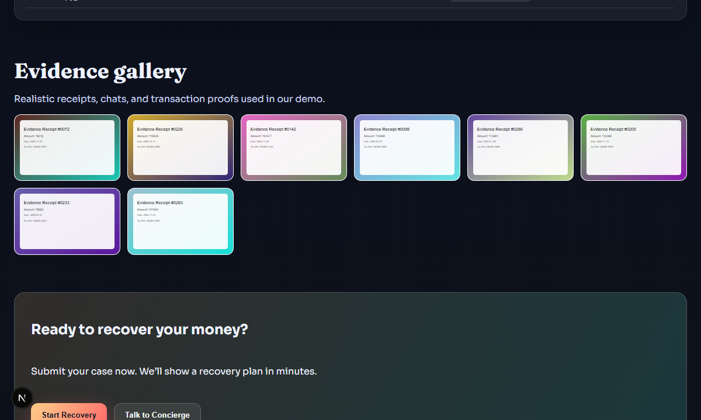
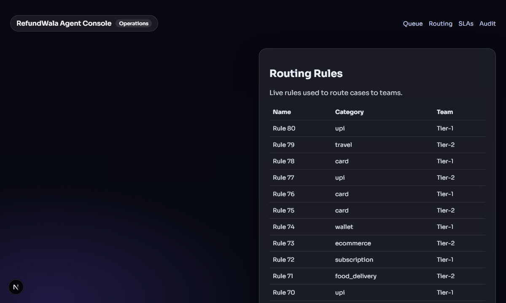
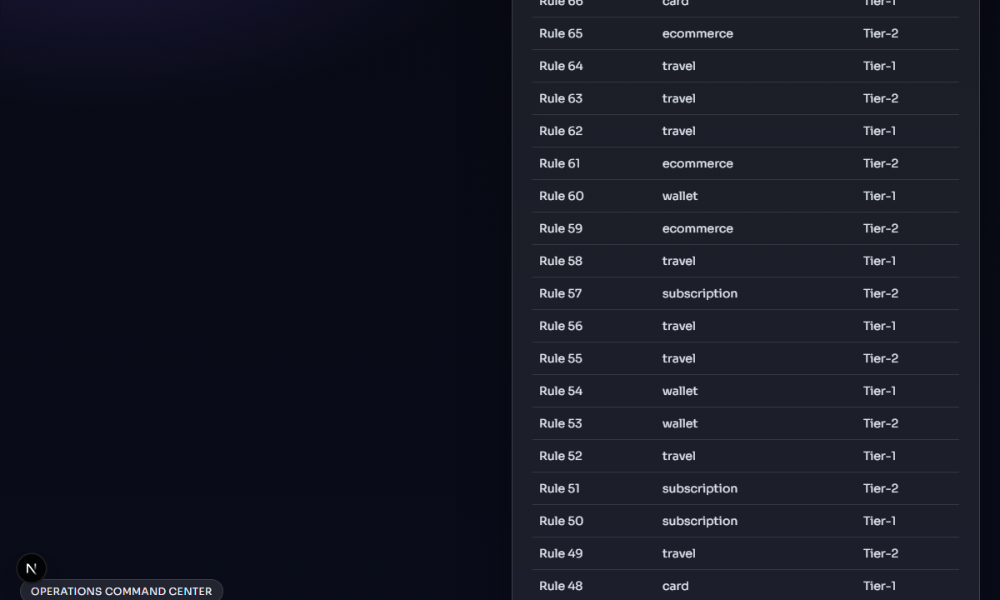
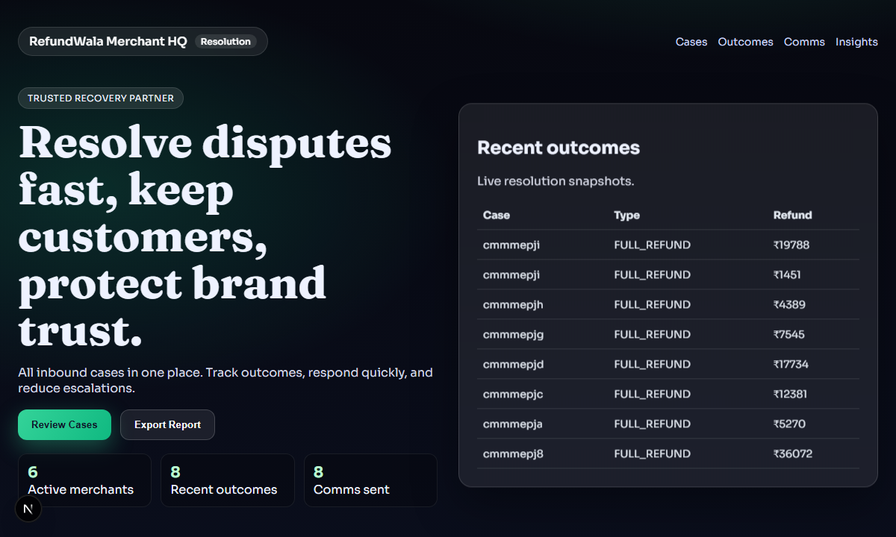
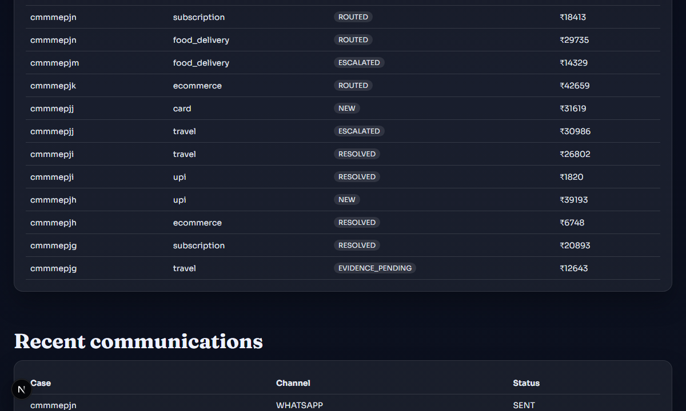

# RefundWala

Revenue-first refund recovery platform with a concierge workflow, evidence vault, and enterprise-ready roadmap. Built for India-first consumers and merchants, with local-first infrastructure and zero paid dependencies for demo.

## Highlights
- Live MySQL-backed demo data across consumer, agent, and merchant apps.
- Evidence gallery with generated receipts and proofs.
- Routing rules, SLA timers, audit logs, and outcomes for realistic operations flow.
- Fast path to enterprise with RBAC, audit trails, and analytics.

## Quick Start
1. Start MySQL (XAMPP) and Redis/RabbitMQ/MinIO as needed.
2. Install dependencies:
   - `npm.cmd install`
3. Generate Prisma client:
   - `npm.cmd --workspace services/api run prisma:generate`
4. Run DB migration:
   - `npx.cmd prisma migrate dev --name init --skip-seed` (from `E:\Codex-Idea\services\api`)
5. Seed big demo data:
   - `npm.cmd --workspace services/api run seed`
6. Run services:
   - `npm.cmd run dev:api`
   - `npm.cmd run dev:worker`
7. Run apps:
   - `npm.cmd run dev:web`
   - `npm.cmd run dev:admin`
   - `npm.cmd run dev:merchant`

## Local URLs
- Consumer: http://localhost:3000
- Agent console: http://localhost:3001
- Merchant dashboard: http://localhost:3002
- API health: http://localhost:4000/health

## Problem & What We Solve
Refund delays and dispute friction are a recurring consumer pain across e-commerce, travel, and services. Public reporting shows large volumes of refund grievances and frequent refund-related complaints, especially in travel and airline categories. Our product centralizes evidence, escalates with SLAs, and provides auditability so refunds close faster and with less back-and-forth.

Research links:
- Ministry of Consumer Affairs PDF on National Consumer Helpline refunds. [Press release PDF](https://consumeraffairs.gov.in/public/upload/admin/cmsfiles/pressRelease/National_Consumer_Helpline_Facilitates_52_Crore_in_Refunds_Across_31_Sectorspress_release.pdf)
- DGCA complaint categories include refund concerns (DD News). [DGCA report summary](https://ddinews.gov.in/national/dgca-report-flight-issues-and-refund-concerns-top-complaint-list)
- Aviation regulator flags refund issues among passenger complaints (NDTV). [NDTV coverage](https://www.ndtv.com/india-news/baggage-refund-issues-among-major-passenger-complaints-aviation-regulator-4521595)
- Survey: cancellations and refunds without compensation (Fortune India). [Fortune India survey](https://www.fortuneindia.com/business-news/61-indian-fliers-faced-airline-cancellations-in-last-12-months-no-compensation-localcircles/121526)
- Refund delay penalties highlight refund disputes (Economic Times). [Economic Times coverage](https://m.economictimes.com/wealth/personal-finance-news/amazon-retailer-fined-rs-45000-for-refund-delay-of-faulty-laptop-delivered-to-customer/amp_articleshow/108812205.cms)

## Screenshots

## Architecture
- `apps/web` consumer web experience
- `apps/admin` agent console
- `apps/merchant` merchant dashboard
- `services/api` Fastify API + Prisma
- `services/worker` BullMQ worker
- `packages/shared` shared types
- `infra` local infra setup

## Future Implementations
See `docs/roadmap.md` for phased expansion from MVP to enterprise-scale.

## Collaboration
See `docs/collaboration.md` for partnership, integration, and collaboration details.

## Press & Company
See `docs/press-kit.md` for mission, positioning, and demo statistics.

## Credits
Built by **rxhtt**  
GitHub: [https://github.com/rxhtt](https://github.com/rxhtt)  
Portfolio: [https://portfolio-rohit-teal.vercel.app/](https://portfolio-rohit-teal.vercel.app/)  
Email: bagewadirohit07@gmail.com
